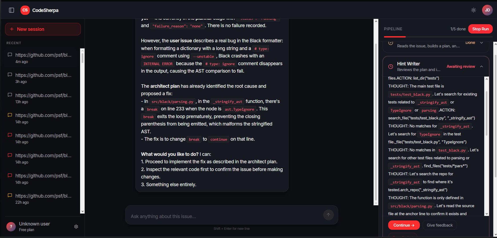

# 🏔️ CodeSherpa

<div align="center">

**Autonomous Multi-Agent GitHub Issue Resolution & Verification Engine**

[](https://www.python.org/)
[](https://fastapi.tiangolo.com/)
[](https://vitejs.dev/)
[](https://e2b.dev/)
[](https://openrouter.ai/)
[](https://www.postgresql.org/)

<p align="center">
  <em>An end-to-end autonomous software engineering pipeline that investigates complex GitHub issues, indexes codebases into semantic knowledge graphs, provisions isolated cloud sandboxes, writes reproducer tests, implements surgical patches, and verifies fixes with human-in-the-loop oversight.</em>
</p>

</div>

---

## 📸 Preview

<!-- Place your screenshot in the assets/ directory or link it here -->
<div align="center">
  
  <p><em>CodeSherpa Live Stage Progression, Real-Time Streaming Logs & Interactive Intervention Console</em></p>
</div>

---

## 🌟 Key Highlights & Innovations

- **🤖 Multi-Agent Specialized Architecture**: Deconstructs issue resolution into distinct, purpose-driven agents (*Architect / Planner*, *Hint Supervisor*, *Test Writer*, *Implementer*, *Verifier*) instead of relying on a monolithic prompt.
- **🌳 AST-Powered RepoGraph**: Indexes target repositories into Abstract Syntax Trees (AST) and directed dependency graphs using **Tree-Sitter** and **NetworkX** to generate localized Ego-Graphs for fast and token-efficient codebase navigation.
- **☁️ Ephemeral Cloud Sandboxing (E2B)**: Automatically discovers project configurations (`pyproject.toml`, `setup.cfg`, `conda.yaml`, etc.), provisions matching Python runtime environments on-the-fly with `uv`, and executes code securely inside isolated **E2B Sandboxes**.
- **🧪 Test-Driven Reproducer Engine (TDD)**: Forces the *Test Writer* agent to construct a minimal failing test case reproducing the reported bug **before** any production code is modified.
- **🔄 Human-in-the-Loop (HITL) & Checkpoint Rewind**: Every stage outcome is persisted in **PostgreSQL**. Users can pause runs, inspect diffs, send guidance or hints via chat, and rewind the pipeline to previous stages.
- **🛡️ Autonomous Loop Detection & Stuck Intervention**: The *Hint Supervisor* monitors agent trajectories in real time, detecting search loops, stalled tool calls, and auto-injecting corrective turn directives.
- **🔌 Model & Provider Agnostic**: Seamlessly toggle between top-tier coding models (DeepSeek-V3/V4, Claude 3.5 Sonnet, Mistral, GPT-4o) using OpenRouter via `config.py`.


---

## 🧩 Pipeline Breakdown

| Stage | Responsibility | Primary Tools & Techniques |
| :--- | :--- | :--- |
| **RepoGraph Ingestion** | Clones repo, parses symbols, function signatures, and call hierarchies. | `Tree-sitter`, `LibCST`, `NetworkX`, `Grep-AST` |
| **Sandbox Setup** | Probes Python versions, provisions venv via `uv`, installs dependencies. | `E2B Code Interpreter`, `uv`, Subprocess Runner |
| **Architect / Planner** | Ingests the issue, explores the graph, and crafts a technical plan. | Symbol Search, Ego-Graph Lookup, File Slicing |
| **Hint Supervisor** | Translates architectural plans into targeted `TEST_HINT` and `IMPL_HINT`s. | Trajectory analysis, Stuck-loop detection |
| **Test Writer** | Writes a reproducer test confirming the bug fails on the baseline repo. | Cloud Bash, File Read/Write, Pytest Runner |
| **Implementer** | Applies precise, surgical edits to resolve the issue. | AST Search, File Splice/Edit, Git Diff Inspection |
| **Verifier** | Runs the reproducer test + existing test suites to prevent regressions. | Test Runner, Git Commit/Clean, Patch Validator |

---

## 🛠️ Tech Stack

- **Runtime & Language**: Python 3.11.1
- **Backend Framework**: FastAPI, Uvicorn, Pydantic v2
- **Database & Persistence**: PostgreSQL, SQLAlchemy 2.0 (Asyncpg), Alembic
- **Sandboxing & Execution**: E2B Sandbox (`e2b_code_interpreter`)
- **Code Intelligence & Parsing**: Tree-sitter, LibCST, NetworkX, Grep-AST, Pygments
- **LLM Orchestration**: OpenAI SDK via OpenRouter (DeepSeek, Claude, Mistral, GPT)
- **Frontend**: React, Vite, Modern CSS / Tailwind CSS, Lucide Icons

---

## 🚀 Quick Start Guide

### 1. Prerequisites
- **Python 3.11.1** installed
- **Node.js** (v18+) & **npm** installed
- **PostgreSQL** running locally (or connection string ready)
- **E2B API Key** ([Get one here](https://e2b.dev))
- **OpenRouter API Key** ([Get one here](https://openrouter.ai/keys))

---

### 2. Backend Setup

1. **Navigate to the Backend directory**:
   ```bash
   cd Backend
   ```

2. **Create and activate a virtual environment (Python 3.11.1)**:
   ```bash
   # Windows (PowerShell)
   python -m venv .venv
   .venv\Scripts\Activate.ps1

   # macOS / Linux
   python3 -m venv .venv
   source .venv/bin/activate
   ```

3. **Install dependencies**:
   ```bash
   pip install -r requirements.txt
   ```

4. **Configure Environment Variables**:
   Create your `.env` file from the provided template:
   ```bash
   cp .env.example .env
   ```
   Open `.env` and fill in your credentials:
   ```env
   E2B_API_KEY=your_e2b_api_key
   OPENROUTER_ARCH_KEY=your_openrouter_api_key
   JWT_SECRET=your_super_secret_jwt_key
   ```

5. **Start the Backend Server**:
   ```bash
   # Using Uvicorn CLI
   uvicorn main:app --port 8000
   ```
   *Alternatively, launch using VS Code Debugger (`F5`) targeting `main:app`.*

---

### 3. Frontend Setup

1. **Navigate to the Frontend workspace**:
   ```bash
   cd Frontend/vite-project
   ```

2. **Install Node dependencies**:
   ```bash
   npm install
   ```

3. **Launch the development server**:
   ```bash
   npm run dev
   ```
   *The dashboard will be available at `http://localhost:5173`.*

---

## ⚙️ Configuration & Customization

All LLM models, provider endpoints, and agent behavior parameters are centralized in [`Backend/config.py`](file:///c:/Users/Tanmay/agents/CodeSherpa/Backend/config.py).

### Changing LLM Models or Providers
To change the orchestrator model or point to another provider, update `config.py`:

```python
# Backend/config.py

# 1. Select your target model on OpenRouter:
MODEL = "deepseek/deepseek-v4-flash"
# Other tested options:
# MODEL = "deepseek/deepseek-v4-pro"
# MODEL = "anthropic/claude-3.5-sonnet"
# MODEL = "mistralai/mistral-medium-3.5-128b"

# 2. Configure API Client:
client = OpenAI(
    api_key=os.environ.get("OPENROUTER_ARCH_KEY"),
    base_url="https://openrouter.ai/api/v1",
)
```


---

## 🧪 Testing

Run backend tests using `pytest`:

```bash
cd Backend
pytest
```

---
